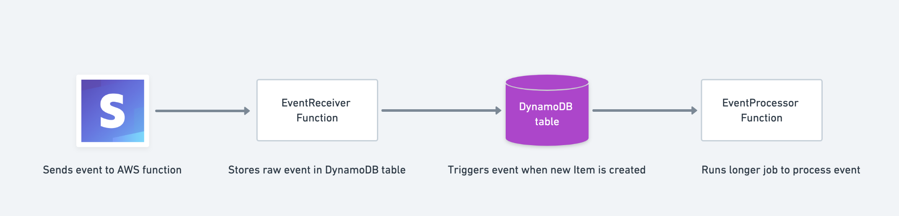

# Storing Stripe webhook events for later processing

Stripe expects a quick response from your webhook handler. If you want to process a longer job it's recommended to store the raw event to a database to process later offline.

Here is an example application using Lambda functions and a DynamoDB table.



1. Stripe sends a request to the EventReciever function through the APIGateway method defined. 

2. EventReciever stores the raw webhook event to the DynamoDB table defined as the TableName in template.yaml.

3. DynamoDB will trigger an event to EventProcessor when the raw Stripe event is added to the table.

4. EventProcessor can take as long as it wants processing the Stripe event!

## Deployment Parameters

There are three required environment variables:

- `TABLE_NAME`, the name of the table in DynamoDB. By default its stripe-event-log, if you want to use a different table be sure to update TABLENAME in template.yaml.
- `STRIPE_WEBHOOK_SECRET`, the secret of your webhook. Used to verify the signature sent in the webhook header to ensure the request is from Stripe.
- `STRIPE_SECRET_KEY`, used to send API requests from your server to Stripe.

## Latest Release - 0.0.0

Initial release.

## How to deploy with SAM

1. Download the AWS SAM CLI: https://docs.aws.amazon.com/serverless-application-model/latest/developerguide/serverless-sam-cli-install.html

**On Mac OS**
Using Homebrew

```
brew tap aws/tap
brew install aws-sam-cli
```

2. Create a S3 bucket

```
aws s3 mb s3://stripe-process-events-sample
```

3. Package the application 
```
sam package --template-file template.yaml --s3-bucket stripe-process-events-sample --output-template-file output.yaml
```

4. Deploy the application 
```
sam deploy --template-file ./output.yaml --stack-name stripe-process-events-sample --capabilities CAPABILITY_IAM
```
