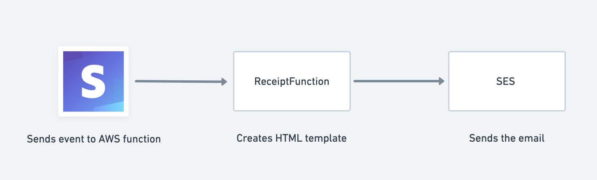

# Sending a Custom E-mail Receipt with AWS Lambda

## Description

This Lambda is a webhook handler that listens for a payment_intent.succeeded event and creates a custom e-mail receipt with the relevant params.



## Deployment Parameters

There is one environment variable required to send email:

- `FROM_EMAIL`, a required parameter, represents the email sender. Must be a SES verified email. If you attempt to send email using a non-verified address or domain, the operation results in an "Email address not verified" error.

There are a few optional environment variables if you want to customize the sample HTML email template to test emails:

- `MERCHANT_NAME`, your business' name.
- `BRAND_COLOR`, your business' brand color.
- `BRAND_LOGO`, your business' logo.

## Latest Release - 0.0.0

Initial release.

## How to deploy locally

This assumes you already have an AWS and Stripe account.

1. Download the AWS SAM CLI: https://docs.aws.amazon.com/serverless-application-model/latest/developerguide/serverless-sam-cli-install.html

**On Mac OS**
Using Homebrew

```
brew tap aws/tap
brew install aws-sam-cli
```

2. Verify the e-mail you want to send the receipts from:

```
aws ses verify-email-identity --email-address you-email@your-domain.com
```

3. Create a S3 bucket

```
aws s3 mb s3://stripe-custom-receipt-sample
```

4. Package the application

```
sam package --template-file template.yaml --s3-bucket stripe-custom-receipt-sample --output-template-file output.yaml
```

5. Deploy the application

```
sam deploy --template-file ./output.yaml --stack-name stripe-custom-receipt-sample --capabilities CAPABILITY_IAM
```
