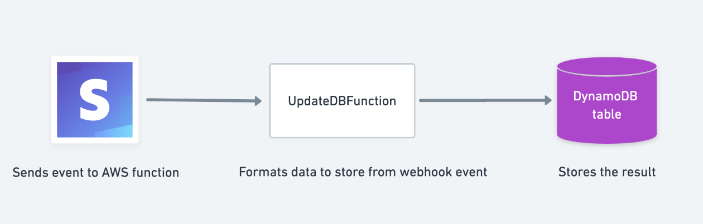

# Updating a DynamoDB table

## Description

A common webhook workflow involves adding a record of the payment to your database. Stripe sends information in the event about the resource, making it easy to gather the right order details to store.
This Lambda function is a webhook handler that listens for a payment_intent.succeeded event and add a new item to a table in DynamoDB.



## Deployment Parameters

There are three required environment variables:

- `TABLE_NAME`, the name of the table in DynamoDB you want to add an item to.
- `STRIPE_WEBHOOK_SECRET`, the secret of your webhook. Used to verify the signature sent in the webhook header to ensure the request is from Stripe.
- `STRIPE_SECRET_KEY`, used to send API requests from your server to Stripe.

## Latest Release - 0.0.0

Initial release.

## How to deploy with SAM

1. Download the AWS SAM CLI:

```
brew tap aws/tap
brew install aws-sam-cli
```

2. Create a S3 bucket

```
aws s3 mb s3://stripe-db-demo
```

3. Package the application

```
sam package --template-file template.yaml --s3-bucket stripe-db-demo --output-template-file output.yaml
```

4. Deploy the application

```
sam deploy --template-file ./output.yaml --stack-name stripe-db-demo --capabilities CAPABILITY_IAM
```
